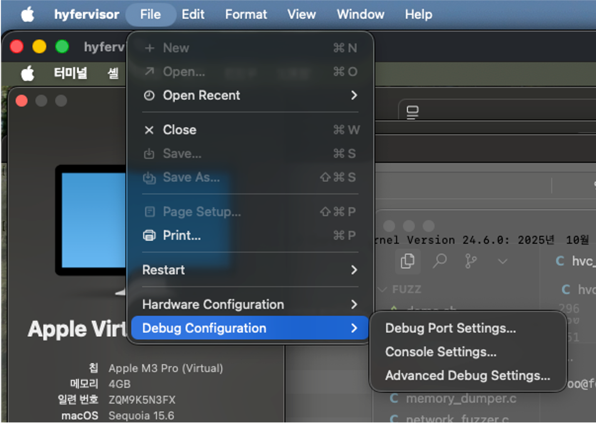
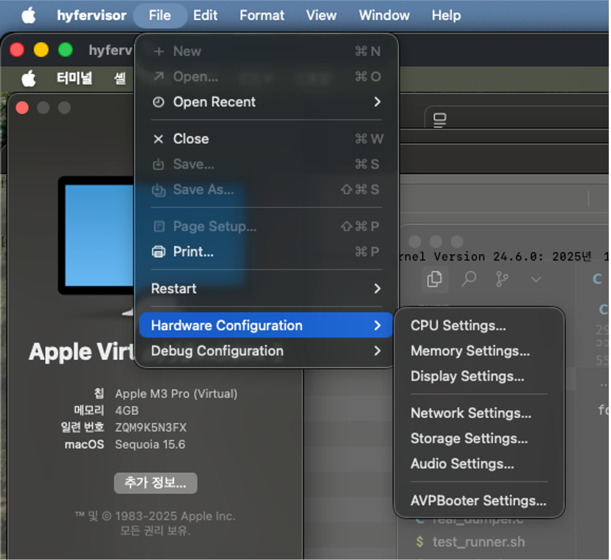
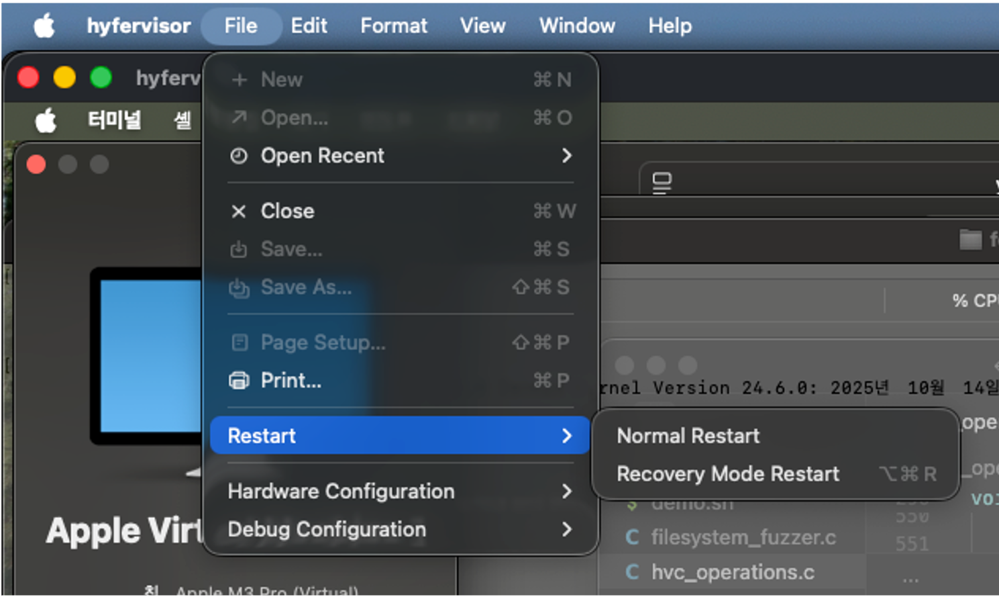
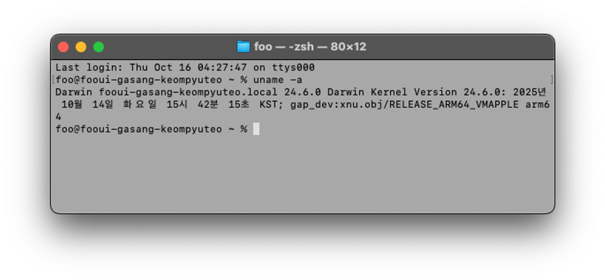
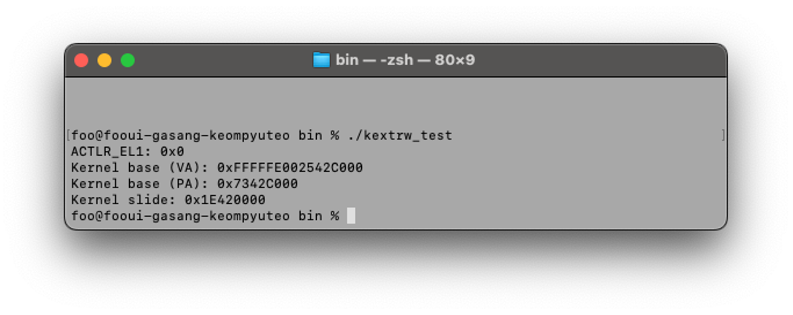
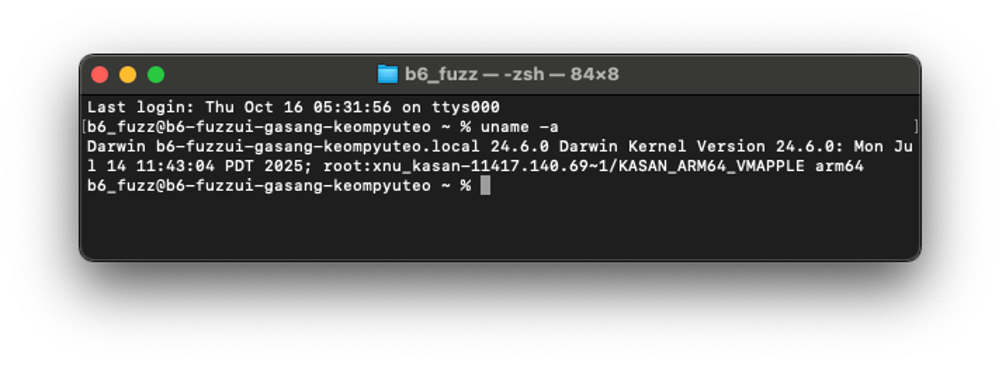
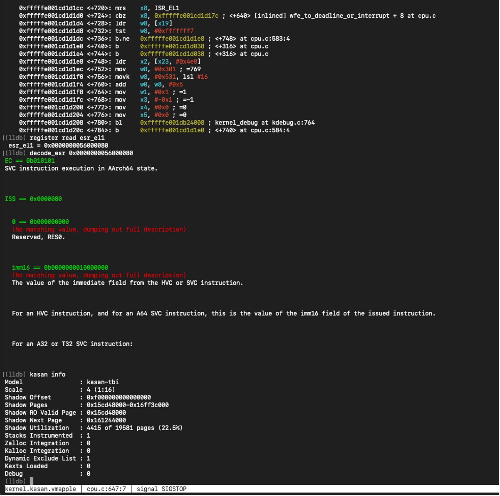
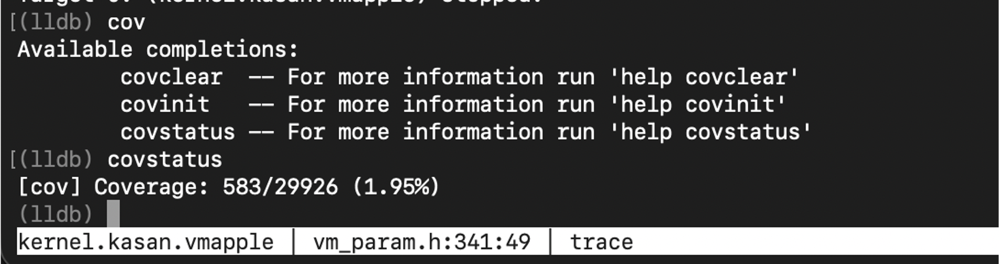

# hyfervisor

Virtualization tool for live-debugging the macOS kernel on Apple Silicon Macs

Lets you live-debug kernels Apple doesn’t officially support, similar to QEMU on Linux

- Boot a self-built XNU kernel alongside custom kexts
- Supports booting KASAN kernels
- Can check coverage via breakpoints (unstable and slow)
- GUI access to 1TR

## Screenshots










## Features

- Run macOS virtual machines
- Hardware acceleration (CPU, memory, graphics, networking, audio)
- GDB debug stub support
- Load custom kernels/kexts

## Requirements

- Apple Silicon Mac (M1/M2/M3/M4)
- macOS 12.0 or later

## Build

```bash
# Full build
make all

# Installation tool
make hyfervisor-InstallationTool-Objective-C

# Main app
make hyfervisor-Objective-C

# Clean
make clean
```

## Usage

```bash
# 1. Install the VM
./build/Build/Products/Release/hyfervisor-InstallationTool-Objective-C <ipsw path>

# 2. Launch the app
open build/Build/Products/Release/hyfervisor-Objective-C.app
```

---


